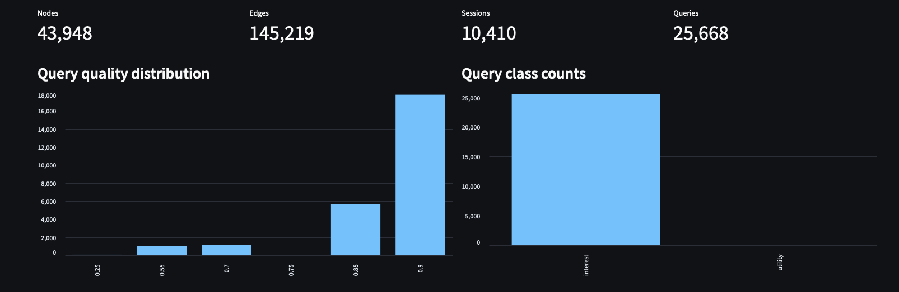
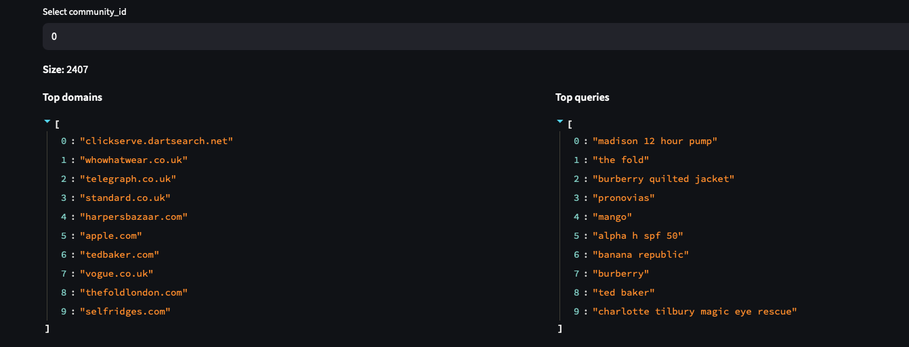
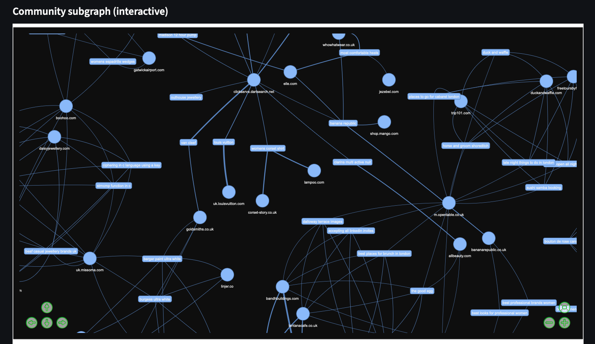
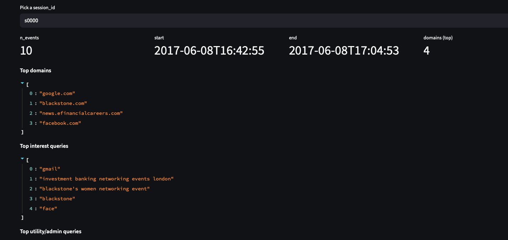
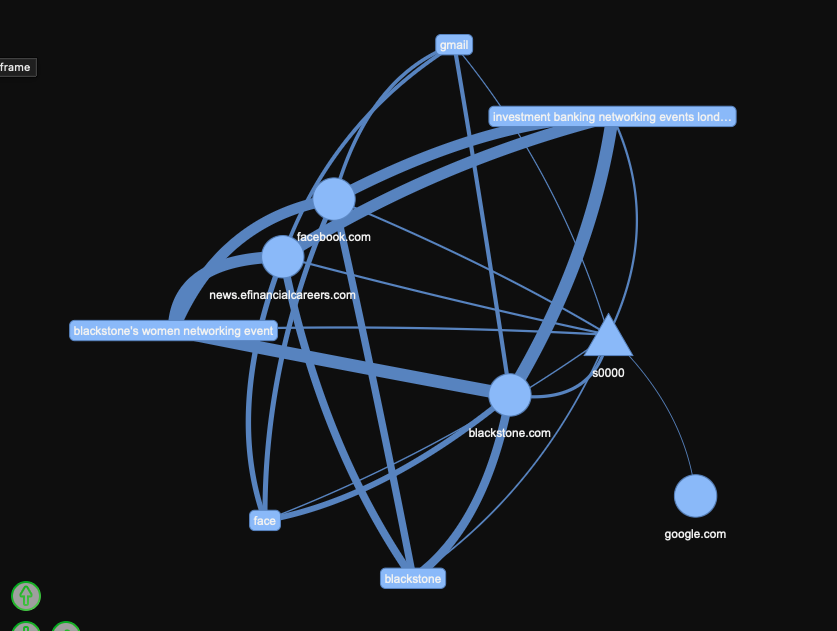

# onFabric Profile Generator

- [onFabric Profile Generator](#onfabric-profile-generator)
    - [TL;DR](#tldr)
  - [Ingest Layer](#ingest-layer)
  - [Graph Layer](#graph-layer)
  - [Agent Layer](#agent-layer)
  - [Figures](#figures)
    - [1) Overall graph + query stats](#1-overall-graph--query-stats)
    - [2) Community summary (top domains + queries)](#2-community-summary-top-domains--queries)
    - [3) Community subgraph (interactive)](#3-community-subgraph-interactive)
    - [4) Session drill-down](#4-session-drill-down)
    - [5) Session ego-graph](#5-session-ego-graph)
  - [Results](#results)
    - [Example output highlights (from PROFILE.md)](#example-output-highlights-from-profilemd)
    - [Where the LLM improved quality in this run (and why it’s included)](#where-the-llm-improved-quality-in-this-run-and-why-its-included)
    - [How to interpret “mass”](#how-to-interpret-mass)
  - [Failed attempts](#failed-attempts)
    - [1) Pulling context from every visited link](#1-pulling-context-from-every-visited-link)
    - [2) SEARCH-R1-style navigation for representation](#2-search-r1-style-navigation-for-representation)

### TL;DR
- **Ingest:** parse messy Chrome/Takeout history into clean, UTC-sorted events and deterministic sessions (avoid inventing queries; normalize domains; de-redirect URLs).
- **Graph:** build a small evidence graph (sessions/domains/queries) with noise-aware weights (`psignal`) and hub-domain handling, then derive topics from a domain–query projection.
- **Agent:** convert topics + evidence into a user-facing profile (themes + snapshot). Optionally use an LLM to semantically compress and prune evidence while staying grounded in retrieved graph evidence.

## Ingest Layer

The ingest layer converts raw Chrome History JSON into a clean, deterministic stream of events that the rest of the system can safely build on. The main goal here is to normalize messy real-world logs without inventing signal, because the downstream graph is extremely sensitive to “synthetic” or noisy nodes.

<ins>What comes in</ins>

A Takeout JSON file exported as a flat list of browsing entries (mixed “Searched for…”, “Visited…”, “Viewed…”, and other rows), with inconsistent URL formats and domain variants.

What goes out

A chronological list of normalized Event objects plus a session mapping. Each event contains:
-	a stable timestamp (UTC)
-	an extracted destination URL (de-redirected where needed)
-	a normalized domain (reduced fragmentation)
-	an optional search query only when the event is truly a search

Key design choices:

1. Only treat real “Searched for …” rows as queries
This is the most important decision in ingest. Browsing logs contain many visit/view events, and if you treat those as queries (or try to infer queries from them), you create huge “supernodes” (like google.com) that connect everything and collapse communities.
So ingest is conservative: only explicit search events produce query text. Visits/views remain evidence through domains and session context.

1. Normalize domains to reduce fragmentation
Takeout data contains many variants of the same site (e.g., www., mobile, country TLDs, language subdomains). If each variant becomes a different node, the graph splits signal unnecessarily.
So ingest normalizes a few high-impact families (Google / YouTube / Wikipedia) into canonical domains to keep the graph stable and interpretable.

1. Resolve Google redirect URLs to the true destination
Many Takeout rows store titleUrl as a Google redirect (/url?q=...). If you keep that, the graph overrepresents Google and underrepresents what the user actually visited.
So ingest extracts the actual target URL where possible.

<ins>Sessionization</ins>

After normalization, events are grouped into sessions using a simple time-gap rule (default: 30 minutes). Session IDs are deterministic (s0000, s0001, …) and embedded into the event ID to make downstream joins easy.

Why this matters

In a browsing-history setting, noise dominates (auto-complete fragments, utility queries, repeated patterns, random navigations). The ingest layer is where you prevent the system from “hallucinating structure” too early. The guiding principle is:

Preserve raw evidence, normalize only what causes fragmentation, and avoid generating synthetic query nodes.

That gives the graph layer a clean, grounded substrate to build meaningful communities and profiles.

---
## Graph Layer

The graph layer turns sessionized browsing events into a compact, explainable structure that supports two things:
1.	Topical discovery (what themes appear in the user’s history)
2.	Evidence retrieval (which sessions/domains/queries support a given theme)

The goal is not to “predict” a profile directly from the graph; the goal is to build an evidence backbone that is stable under noise and can be summarized reliably (by rules or by an LLM).

<ins>Graph Schema</ins>

We build a minimal heterogeneous graph with three node types:
-	Session nodes: s:<session_id>
-	Domain nodes: d:<domain>
-	Query nodes: q:<query>

This minimal schema is intentional:
-	it reduces brittleness,
-	avoids dependency on fragile NLP pipelines,
-	stays interpretable and auditable (easy to trace “why” a conclusion happened).

<ins>Edges and What They Mean</ins>

The graph uses three weighted edge types:
1.	session–domain
Captures which sites were involved in a session.
2.	session–query
Captures which searches occurred in a session.
3.	domain–query
Captures query/domain co-occurrence within sessions (a signal for topical coupling).

All edges are weighted; weights are not arbitrary — they are designed to downweight noise and hubs while keeping real repeated interests strong.

<ins>The Core Idea: Soft Noise Handling via psignal</ins>

Browsing history is extremely noisy: fragments (“w”), utility queries (“speed test”), and bursts (“internet speed test” repeated 150 times).

Instead of hard-deleting these (which can destroy context), your graph computes a per-query unsupervised signal score called psignal, using only the user’s own behavior:

psignal increases when a query:
-	appears across multiple sessions (persistent interest),
-	co-occurs across multiple domains (not tied to one narrow admin flow),
-	is not extremely bursty,
-	and passes a basic query-quality gate.

Then psignal affects edge weights:
-	low-psignal queries are de-emphasized (reduced weight),
-	not removed entirely.

This choice is important because it keeps the graph faithful while still reducing the dominance of junk nodes.

<ins>Handling Hubs (Why It Matters)</ins>

Some domains are structurally “unfair” in browsing history; they appear everywhere (Google, YouTube, Wikipedia).
If you treat them like normal domains, they act as super-hubs and glue unrelated topics together.

The build logic treats these hubs explicitly:
-	hub domains are downweighted in session-domain edges
-	hub domains are excluded from domain-query co-occurrence edges

This prevents “everything becomes one community” failures.

<ins>Community Detection Strategy</ins>

Topic clustering is not run on the full heterogeneous graph.

Instead, I compute communities on a domain–query projection:
-    drop session nodes for clustering,
-	because sessions are high-degree bridges and naturally multi-topic.

So the workflow is:
1.	Build full graph for evidence.
2.	Project to domain+query subgraph for cleaner topical structure.
3.	Run modularity-based community detection on that projection.
4.	Summarize each community using top domains/queries by weighted degree.

This separation is the reason the topics became much cleaner once you stopped letting sessions act as bridges during clustering.

<ins>Explainability: Session Trails</ins>

Even though sessions are removed for clustering, they remain crucial for explainability.
I generate per-session “micro-stories” (top domains, top queries, representative titles) directly from raw events.

This gives you a human-debuggable trace:
-	“Here’s the topic”
-	“Here are the sessions that support it”
-	“Here’s what happened in those sessions”

<ins>Challenges and Fixes</ins>

- Challenge 1: Topic mixing from hub-like domains

Even after hub handling in the graph, certain variants (e.g., google.co.uk and subdomains) can sneak into projections and still glue communities.

Fix: drop hub/search-engine domains from the domain–query projection used for communities.

- Challenge 2: Sessions reintroducing mixing during profile extraction

Sessions are multi-intent. If you expand themes by pulling neighbors through sessions, you often contaminate topics.

Fix: don’t use sessions for clustering, and purity-gate sessions when selecting “representative sessions.”

- Challenge 3: Graph clusters != profile statements

Even with clean communities, turning “domains + queries” into a coherent profile requires semantic compression (the LLM layer helps here).

Fix: treat the graph as evidence, and use LLM as interpretation (grounded by retrieved evidence).

## Agent Layer

The agent layer sits on top of the graph and turns structured evidence (sessions/domains/queries + weights) into a small set of “themes” (“suits”) plus a profile snapshot. Think of it as a two-stage pipeline:
-	Discover themes from graph nodes (queries/domains)
-	Expand each theme with evidence + representative sessions, then optionally summarize with an LLM

It’s designed to be auditable: every theme comes with explicit supporting queries/domains/sessions, so the LLM (if used) is interpreting evidence rather than inventing.

<ins>Inputs and outputs</ins>

Inputs
-	G: the history graph (from build_graph.py)
-	events: sessionized Takeout events
-	trails: session trails (for readable “what happened” snippets)

Outputs
-	A list of theme cards (suits): label, top queries/domains, sessions, evidence lists
-	A snapshot

<ins>How the agent works (big picture)</ins>

1. Context building for richer evidence (context.py)

Before doing any “profile” inference, the agent builds lightweight per-query context from raw events:
-	top effective domains for each query
-	URL path tokens (optional weak signal)
-	a few representative titles / URLs

This helps later steps avoid relying only on short query strings.

2. Theme discovery (“suits”) from graph items (suits.py + text.py)

The graph has many nodes; the agent focuses on the most meaningful ones:
-	It extracts query and domain nodes from the graph and computes:
-	df_sessions (how many sessions they appear in)
-	mass (how strongly they connect to sessions)
-	query metadata (psignal, qquality) for filtering

Then it builds a simple semantic representation:
-	TF-IDF over query text
-	domains represented as "site <domain>" to make them clusterable with queries

<ins>Suits = soft clustering over query vectors</ins>
-	Seeds are chosen by a score that combines:
-	psignal (signal vs noise)
-	persistence across sessions (df_sessions)
-	overall mass
-	Seeds are merged into existing suits if cosine similarity is above sim_threshold

This produces a small number of high-mass themes.

<ins>Key knobs (config.py)</ins>
-	seed_psignal_min: how “signal-heavy” a query must be to seed a theme
-	sim_threshold: theme purity vs number of themes (higher = fewer, cleaner)
-	max_suits, top_*: output size controls

3) Evidence expansion + leakage control (expand.py)

Theme discovery alone can be too “keyword-y”. Expansion adds evidence while trying hard not to mix topics.

Expansion has two parts:

A) Primary evidence (semantic affinity)
-	Scan items whose TF-IDF vectors are similar to the suit centroid
-	Keep a capped set as primary evidence

B) Supporting evidence via sessions (most risky)
Sessions naturally contain mixed intent, so session expansion is gated heavily:
-	find sessions most connected to the suit’s strong queries
-	pull neighbor items from those sessions
-	keep them only if they pass precision gates:
-	session_gate_sim (must be close to the suit centroid), OR
-	token overlap with suit signature + minimum psignal

Additionally:
-	drop “generic” domains that appear in too many sessions (domain_max_session_frac)
-	dedupe evidence across sessions

This is where most “graph feels shaky” issues come from, so the gating is the agent’s main stabilization mechanism.

4) Snapshot generation (snapshot.py)

The snapshot is a compact “profile summary” (location/lifestyle/fashion/travel/work/etc.). There are two modes:

Non-LLM fallback (evidence-grounded)
-	pulls a broader set of queries than just top_queries:
	-	top queries
	-	high-psignal items from evidence lists
	-	queries connected to representative sessions
	-	applies conservative pattern-based extractors (no invention)

LLM mode
-	the LLM is used as an interpretation layer:
	-	compresses weak cues into stable concepts
	-	removes mixed/irrelevant items
	-	writes coherent prose

<ins>Important stabilization trick</ins>
After the LLM prunes queries, the agent can recompute representative sessions from the kept queries, so session evidence aligns with the final theme and mixing decreases.

<ins>Post-enrichment</ins>
Even if the LLM snapshot is conservative or misses long-tail evidence, _enrich_snapshot_with_evidence() backfills fashion/travel/places using the broader evidence gatherer (still no hallucination).

5) Report / artifacts (io.py)

Finally, the agent writes:
-	JSON artifacts for debugging + downstream use
-	a human-readable Markdown profile:
-	snapshot bullets
-	per-theme paragraph + top queries/domains
-	representative sessions with short “trail” titles

---

<ins>What the agent layer is optimizing for</ins>

<ins>Goal</ins>

Stable, explainable themes + profile, under high noise and mixed browsing sessions.

Main challenges and mitigations
-	Mixed sessions -> topic bleed
-	mitigate with session gating (session_gate_sim, overlap + psignal), and generic-domain suppression
-	Short queries are semantically weak
-	mitigate by using query context and TF-IDF bigrams
-	Top-k lists miss long-tail signal
-	mitigate with broader snapshot query gathering (evidence lists + session neighbors)
-	LLM vs graph mismatch
-	mitigate by recomputing sessions after LLM pruning + keeping evidence-grounded fallbacks

## Figures

### 1) Overall graph + query stats

This view helps sanity-check scale (nodes/edges/sessions/queries) and whether the query-quality / query-class split looks reasonable.

### 2) Community summary (top domains + queries)

This view shows what a detected community *means* in plain terms: the most central domains and queries inside that cluster.

### 3) Community subgraph (interactive)

This view is useful for spotting “topic bleed” (bridge domains/queries) and verifying that the community is not being held together by hub-like sites.

### 4) Session drill-down

This view shows a single session’s top domains and queries, which is helpful for debugging mixed-intent sessions.

### 5) Session ego-graph

This view makes it easy to see how a session connects to domains and queries (and whether a particular query is acting like a bridge).

## Results

This run produces a **snapshot + 8 themes (“suits”)**, each grounded with **top queries/domains + representative sessions**. Even though the underlying graph is large (≈43,948 nodes, ≈145,219 edges, ≈10,410 sessions, ≈25,668 queries), the output stays debuggable because every claim links back to concrete evidence.

### Example output highlights (from [PROFILE.md](artifacts/PROFILE.md))
- **High-confidence location: United Kingdom.** Multiple independent UK cues converge: IKEA UK pages, UK settled-status / EU Settlement Scheme queries, Zoom UK dial-in, and KCL student-records usage.
- **Home / lifestyle: IKEA kitchen planning.** The top theme (*Kitchen Islands & Cabinets*, mass≈151.9) is highly coherent: repeated IKEA queries (“ikea uk”, “ikea kitchen cabinets”, “kitchen island”), plus direct visits to IKEA UK category pages.
- **Work: student/admin + job search workflow.** KCL student-records queries combined with heavy Otta activity (Deliveroo/Cleo/Checkout.com/Lendable roles) and Zoom usage forms a consistent “student/job-seeker in the UK” picture.
- **News: Russia–Ukraine focus.** The *Russia–Ukraine Conflict* theme is stable, supported by repeated news/history queries and long-running coverage browsing.
- **Secondary signals:** light fashion/shopping (e.g., Van Cleef, event dresses/gowns) and travel/visa planning (Schengen/UK travel visa queries), plus a weak India link (“chennai drive”, IKEA India).

### Where the LLM improved quality in this run (and why it’s included)
The graph is strongest at **structure + retrieval**, but weak at turning sparse/noisy evidence into clean profile statements. In this specific output, the LLM adds value by:
- **Fixing label corruption from word overlap.** A furniture topic was previously mislabeled due to the word “island” bridging into an unrelated label (e.g., “Dental_Island”). The LLM judge correctly renames it to *Kitchen Islands & Cabinets* and explains the failure mode.
- **Separating adjacent intents inside a cluster.** Immigration-related queries often co-occur. The LLM prunes general visa/travel queries and keeps the theme narrowly about the **EU Settlement Scheme**, preventing a “mixed immigration blob.”
- **Inferring stable concepts from multiple weak cues.** Example: graph-only logic can output “can’t figure out” when no single query is explicit; the LLM can combine multiple UK-specific signals into a confident “UK” conclusion while staying grounded in evidence.

### How to interpret “mass”
Mass is a ranking signal (persistence/connectedness), not a probability. I always show evidence lists + sessions so each theme can be audited.

## Failed attempts

A couple of approaches were tried early on but ultimately rejected because they either didn’t scale or didn’t produce richer profiles.

### 1) Pulling context from every visited link

Idea: fetch each URL and extract page context (titles/snippets/metadata) to enrich every datapoint before building themes.

Why it failed:
- Too expensive and slow at realistic scale (tens of thousands of URLs).
- Many pages are blocked, dynamic, or behind auth/paywalls, so coverage is inconsistent.
- Adds a lot of boilerplate noise (cookie banners, nav text) unless you build a full extraction pipeline.

What I kept: limited “context” signals already available in the log (domain + Takeout title) and representative-session trails, which are cheap and reliable.

### 2) SEARCH-R1-style navigation for representation

Idea: use a search/navigation agent (SEARCH-R1 vibe) to traverse the graph under a budget and return “best evidence” for a profile.

Why it failed:
- Those methods are optimized for retrieval/navigation, not for stable representation learning.
- Even after tuning budgets/coverage, the outputs were not deep or rich enough: they surfaced facts, but didn’t consistently form coherent, multi-facet profiles.
- The traversal was sensitive to bridge nodes and mixed sessions, so results varied too much run-to-run.

What I kept: the budgeted-evidence mindset (caps, purity gates), but combined it with topic projection + semantic grouping and an LLM summarizer for final compression.

